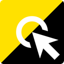
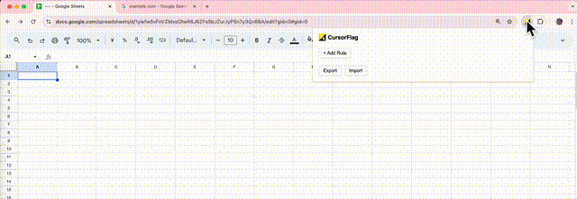
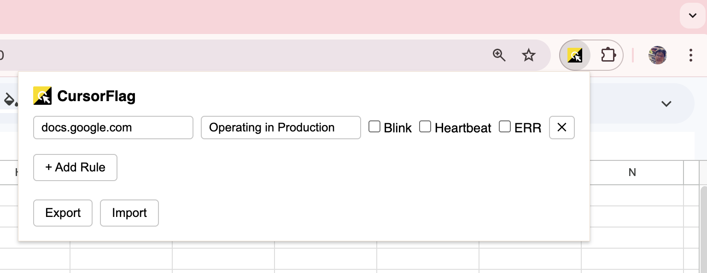
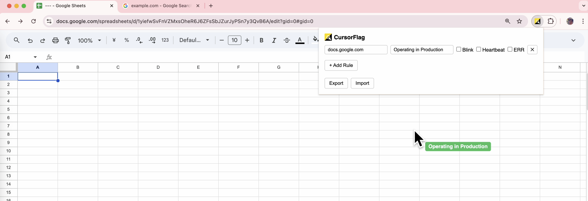
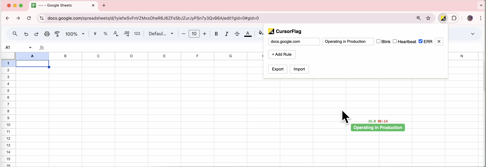

# CursorFlag

A Chrome extension that displays a label next to your cursor on specific domains. Never confuse production with staging again.

## Features

- **Domain-based Rules** - Set up rules per domain with custom label text. Auto-fills the active tab's domain.
- **Visual Effects** - Blink and heartbeat animations. Label colors are derived from the text.
- **Error Counter** - Track JS errors and network failures in real-time above the label.
- **Import / Export** - Share rules with teammates as JSON.

## Screenshots

| Popup | Default | Error Counter |
|-------|---------|---------------|
|  |  |  |

## Installation

1. Clone the repository
2. `pnpm install && pnpm build`
3. Open `chrome://extensions`
4. Enable Developer mode
5. Click "Load unpacked" and select the `dist` folder

## Tech Stack

- TypeScript
- Vite + [@crxjs/vite-plugin](https://github.com/nicedoc/crxjs)
- Chrome Extensions Manifest V3
